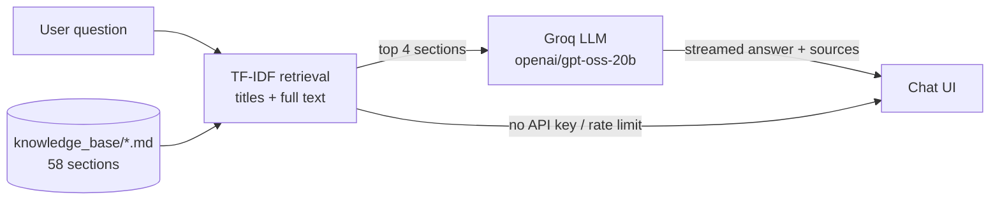

# ai-chatbot-soil-erosion

**SoilSense** – an AI chatbot that answers questions about **soil-erosion control and soil conservation techniques**.
It combines a curated knowledge base, a retrieval system and a Large Language Model (LLM), so answers are grounded in
reliable agricultural content instead of the model's memory.

Built as a college project: the faculty can ask about any individual technique (contour farming, terracing,
mulching, windbreaks, check dams, …), ask for classifications (agronomic / vegetative / mechanical methods,
water- vs wind-erosion control) or ask for comparisons (e.g. *contour farming vs terracing*).

---

## Features

- **Curated knowledge base** – 58 sections covering 40+ soil-erosion control techniques, each with definition,
  working principle, how it reduces erosion, suitable conditions, advantages and limitations.
- **Retrieval-Augmented Generation (RAG)** – TF-IDF retrieval finds the most relevant sections; the LLM answers
  **only** from them and says so when a question is outside the knowledge base.
- **Modern chat interface** – streaming answers, Markdown formatting, conversation history (saved in the browser),
  follow-up questions, sources shown under every answer, copy / regenerate / stop, light & dark theme,
  mobile-friendly and keyboard/screen-reader accessible.
- **Works offline** – without an API key (or if the API is rate-limited) the app still answers by showing the
  best-matching knowledge-base section.
- **Low cost** – uses Groq's cheapest production model (`openai/gpt-oss-20b`) with low reasoning effort and a small context.

## How it works



1. Each `## ` section of the Markdown files in `knowledge_base/` is one retrievable chunk.
2. The question is scored against every chunk using two TF-IDF indexes (section titles and full text).
   Comparison sections are only preferred for comparison-style questions; follow-up questions
   (e.g. *"What are its limitations?"*) are matched together with the previous question.
3. The top 4 sections plus the last few chat messages are sent to the Groq LLM with instructions to answer only
   from the provided excerpts.
4. The answer is streamed back to the browser and rendered as formatted text, with the source sections listed.

## Tech stack

| Layer | Technology |
|---|---|
| Backend | Python, Flask |
| Retrieval | scikit-learn (TF-IDF + cosine similarity) |
| LLM | Groq API (`groq` Python SDK), model `openai/gpt-oss-20b` |
| Frontend | Vanilla HTML, CSS and JavaScript (no frameworks, no external CDNs) |

## Getting started

### Prerequisites
- Python 3.10 or newer
- A free Groq API key from [console.groq.com](https://console.groq.com/keys) (optional – see offline mode)

### Installation

```bash
git clone https://github.com/aparupasaha/ai-chatbot-soil-erosion.git
cd ai-chatbot-soil-erosion
pip install -r requirements.txt
```

### Configuration

Copy the example environment file and add your Groq API key:

```bash
cp .env.example .env        # Windows: copy .env.example .env
```

```ini
GROQ_API_KEY=your-groq-api-key-here
GROQ_MODEL=openai/gpt-oss-20b
```

`.env` is git-ignored – never commit your API key.

| Variable | Default | Description |
|---|---|---|
| `GROQ_API_KEY` | *(none)* | Groq API key. If empty, the app runs in offline knowledge-base mode. |
| `GROQ_MODEL` | `openai/gpt-oss-20b` | Any Groq chat model, e.g. `llama-3.1-8b-instant`. |
| `PORT` | `5050` | Port for the web server. |

### Run

```bash
python app.py
```

Open **http://127.0.0.1:5050** and click one of the suggested questions or type your own.
Stop the server with `Ctrl+C`.

## Example questions

- What are the major techniques used to control soil erosion?
- Explain contour farming. / Explain terracing.
- What is the difference between contour farming and terracing?
- What methods control wind erosion? / What methods control water erosion?
- What are agronomic methods of soil conservation? / What are mechanical methods?
- How does mulching reduce soil erosion?
- What is the role of windbreaks?
- What is contour bunding? / What is graded bunding? / What is gully plugging?

## Knowledge base coverage

| File | Content |
|---|---|
| `01_overview.md` | What soil erosion is, causes, classification of all control methods, basic principles, sources |
| `02_agronomic.md` | Crop rotation, strip cropping, cover cropping, contour farming, conservation / reduced / no-till farming, mulching, intercropping, crop-residue management |
| `03_vegetative.md` | Afforestation/reforestation, grass cover, vegetative barriers, shelterbelts, windbreaks, agroforestry, pasture/grassland management, riparian buffer strips |
| `04_mechanical.md` | Contour bunding, graded bunding, terracing, bench terraces, contour trenches, check dams, gully plugging, grassed waterways, diversion drains, water-harvesting structures, sediment traps |
| `05_water_erosion.md` | Water-erosion control methods, runoff management, vegetative cover |
| `06_wind_erosion.md` | Wind-erosion control methods and how each reduces wind velocity, soil detachment and particle movement |
| `07_soil_management.md` | Organic matter, compost/manure, conservation agriculture, soil structure, controlled grazing, avoiding excessive tillage, ground cover |
| `08_comparisons.md` | Contour farming vs terracing, mulching vs cover crops, windbreaks vs shelterbelts, conservation vs conventional tillage, contour vs graded bunding, agronomic vs mechanical, vegetative vs mechanical |

To add knowledge, add a new `## Title` section to any file in `knowledge_base/` and restart the app.

**Sources:** content is summarised from FAO (Soils Portal, Conservation Agriculture), USDA NRCS Conservation Practice
Standards, ICAR/TNAU Agritech material, and textbooks such as R. Suresh, *Soil and Water Conservation Engineering*
and V.V.N. Murty, *Land and Water Management Engineering*. Design figures vary by region; verify them against local guidelines.

## Project structure

```
ai-chatbot-soil-erosion/
├── app.py               # Flask server: retrieval, Groq LLM call, streaming chat API
├── knowledge_base/      # Curated soil-erosion content (one ## section = one chunk)
├── static/
│   ├── index.html       # Chat UI markup
│   ├── app.css          # Styles (light/dark themes, responsive)
│   └── app.js           # Chat client: streaming, history, Markdown rendering
├── test_retrieval.py    # Checks demo questions retrieve the right sections
├── requirements.txt
└── .env.example         # Template for your Groq API key
```

## API

| Method | Endpoint | Description |
|---|---|---|
| `GET` | `/api/status` | `{"live": bool, "model": str, "sections": int}` |
| `POST` | `/api/chat` | Body `{"question": str, "history": [{"role", "content"}]}`. Streams newline-delimited JSON events: `sources`, `notice`, `delta` (answer text), `error`, `done`. |

## Testing

```bash
python test_retrieval.py
```

Verifies that all faculty demo questions, technique questions and comparison questions retrieve the correct
knowledge-base section first, and that off-topic questions retrieve nothing.

## Notes

- Groq's free tier is rate-limited (for `openai/gpt-oss-20b`: about 8,000 tokens per minute). Each question uses
  roughly 3,000 tokens, so space rapid questions out; if the limit is hit, the app automatically falls back to the
  knowledge-base section.
- If HTTPS requests fail behind antivirus or a corporate proxy, the `truststore` package (already used by the app)
  makes Python use the operating system's certificate store.
- Educational project – always confirm technical design values with local soil-conservation guidelines.
